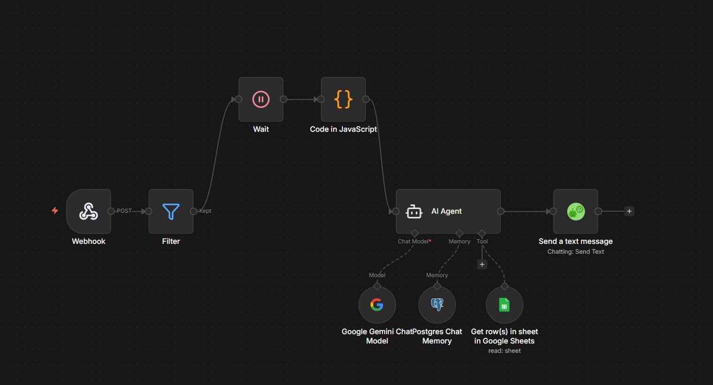
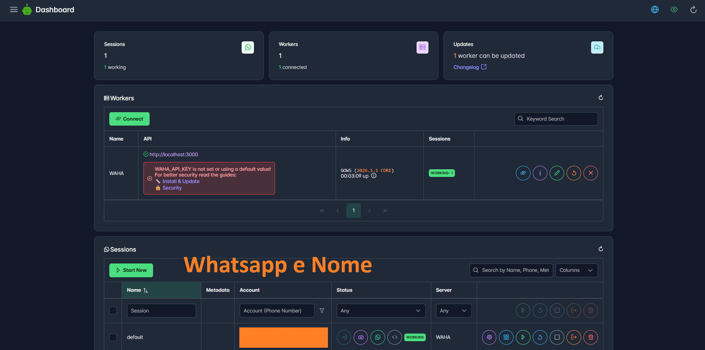
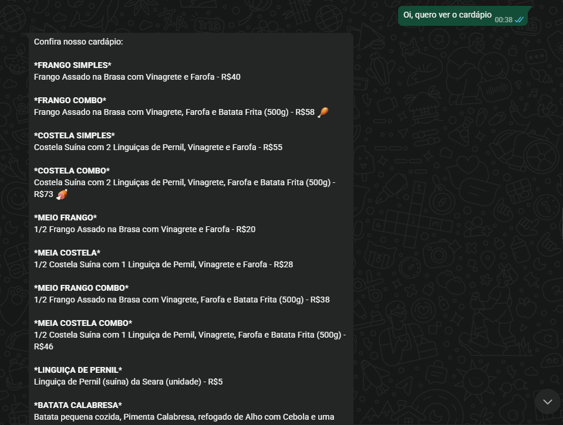
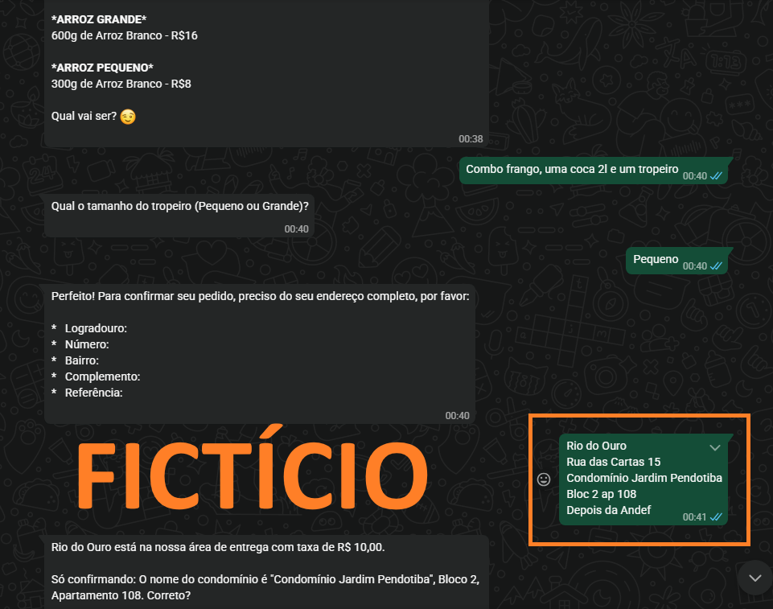
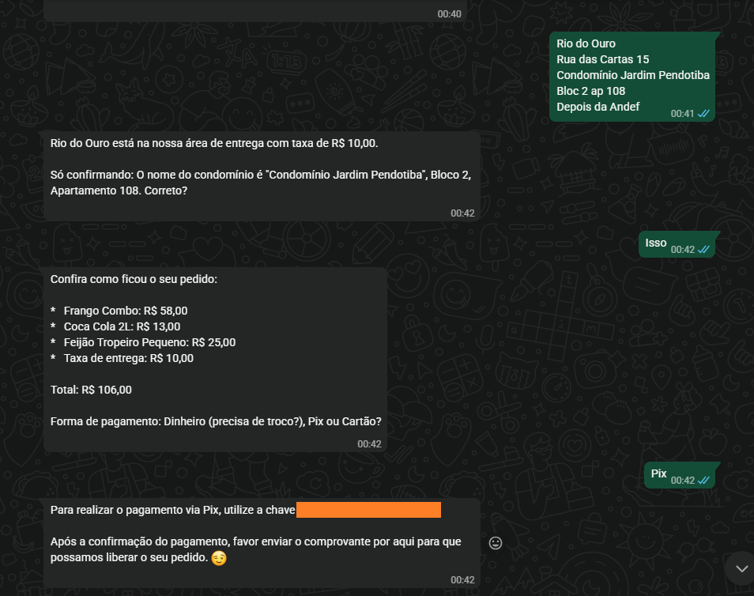

# 🍗 Chatbot AI: Sistema Inteligente de Pedidos e Reservas (n8n + Gemini)

## 🎯 Objetivo e Visão do Projeto
O objetivo principal deste projeto é democratizar o acesso à automação para consumidores que não possuem familiaridade com tecnologia. Muitos clientes evitam clicar em links externos, baixar aplicativos ou realizar cadastros complexos em sites de delivery. 

Este chatbot transforma o **WhatsApp** em uma interface transacional completa via linguagem natural, onde a montagem do pedido ocorre inteiramente dentro da conversa. O foco é remover barreiras de UX (User Experience) e garantir que qualquer pessoa, independentemente da afinidade tecnológica, consiga realizar um pedido de forma rápida e intuitiva.

---

## 🚀 Funcionalidades Detalhadas

* **📅 Inteligência de Calendário Autônomo:** O sistema utiliza expressões dinâmicas (`$now`) para identificar o dia da semana sem intervenção manual. Se detectado que é um dia útil (Segunda a Sexta), o bot automaticamente altera seu fluxo para **Agendamento de Reservas**, bloqueando pedidos de entrega imediata e respeitando a logística do restaurante.
* **📊 Single Source of Truth (SSoT) com Google Sheets:** O cardápio não está "hardcoded" na IA. O bot consulta uma planilha em tempo real para validar nomes de produtos, descrições, disponibilidade (coluna "Disponível") e preços exatos, mitigando erros financeiros.
* **🚚 Validação Logística Geográfica:** Sistema de frete inteligente que diferencia taxas (R$ 5,00 ou R$ 10,00) com base no bairro. Possui uma "trava de segurança" para condomínios específicos (ex: Chácara, Bougainville, Ubá), onde a confirmação só é liberada após o fornecimento obrigatório de **Bloco e Apartamento**.
* **⚡ Algoritmo de Debounce (JavaScript):** Implementação de um nó de código que agrupa múltiplas mensagens enviadas pelo cliente em um curto intervalo (5 segundos). Isso evita o processamento de mensagens picadas, reduz o custo de tokens da API e organiza o contexto para a IA.
* **🛡️ Engenharia de Prompt Determinística:** System Message estruturada em etapas lógicas obrigatórias (Triagem > Consulta > Endereço > Pagamento > Confirmação), elevando a precisão do atendimento e eliminando emojis ou comportamentos inadequados.

---

## 🛠️ Stack Tecnológica
* **n8n:** Orquestrador de workflows (Low-code backend).
* **Google Gemini 2.0 Flash:** LLM utilizado para processamento de intenções e geração de respostas.
* **PostgreSQL:** Banco de dados para persistência de memória de chat (histórico de conversas).
* **WAHA (WhatsApp HTTP API):** Gateway para integração com o WhatsApp.
* **Google Sheets API:** Utilizado como banco de dados relacional para o cardápio.

---

## 📋 Guia de Configuração e Segurança

### 1. Preparação do Workflow (JSON)
O arquivo JSON fornecido neste repositório foi sanitizado para segurança. Foram omitidos os seguintes pontos que você deve configurar manualmente:
* **Credenciais:** IDs de conexão com Google Sheets, Postgres, Gemini e WAHA (campos `credentials` no JSON).
* **IDs de Documentos:** Links e IDs de planilhas privadas (nó `Get row(s) in sheet`).
* **Webhook URL:** O ID único do seu gatilho de entrada.

### 2. Passos para Implementação
1. **Importação:** Importe o JSON no n8n.
2. **Memória:** No nó `Postgres Chat Memory`, configure sua conexão e defina a `Session Key` (ex: `{{ $json.from }}`).
3. **Planilha:** Crie uma planilha com colunas: `Produto`, `Preço`, `Descrição` e `Disponível`. Insira o ID no nó correspondente.
4. **Prompt:** Verifique no nó `AI Agent` se a `System Message` está configurada como **Expression** para processar a data dinâmica.

---

## 📈 Roadmap e Visão de Futuro

Esta é uma **versão inicial (MVP)**. Os próximos passos incluem:
* **☁️ Escala em Nuvem:** Migração da infraestrutura Local para um servidor **VPS**, garantindo estabilidade 24/7 e facilidade de manutenção.
* **🎙️ Reconhecimento de Voz:** Implementação de transcrição de áudio para texto, permitindo que o cliente faça o pedido falando.
* **💾 Automação de PDV e Impressão:** Integração direta via API com o sistema **PagVendas** para registro automático e envio de comandos de impressão para **impressoras térmicas** locais, consolidando o pedido físico para a cozinha.
* **🤖 Refinamento de UX:** Evoluir o prompt para um equilíbrio perfeito entre o fluxo lógico rígido e um tom de voz acolhedor e ágil.

---

🧱 Arquitetura e Infraestrutura
Para que o atendimento funcione de forma automatizada, o projeto utiliza a seguinte estrutura técnica:

1. Orquestração de Fluxo (n8n)
O fluxo foi desenhado para processar a entrada de dados, aplicar inteligência de tempo e consultar o banco de dados antes de retornar ao cliente.

3. Gateway de Comunicação (WAHA)
A integração com o WhatsApp é feita através do WAHA (WhatsApp HTTP API), permitindo o envio e recebimento de mensagens de forma estável e monitorada através de um dashboard dedicado.

---

📸 Evidências de Funcionamento
As imagens abaixo, localizadas na pasta /funcionando, demonstram o sistema operando em conformidade com as regras de negócio estabelecidas:

Atendimento inicial: O sistema identifica o que é dito pelo cliente e prontamente responde com o cardápio.

Lógica do Bot e Integridade de Preços (SSoT): O bot reconhece o pedido do cliente, consulta o Google Sheets e retorna o valor exato dos produtos, evitando a alucinação de valores. Além disso, o bot solicita o endereço de forma proativa.

Logística e Confirmação de Pedidos: Demonstração da coleta obrigatória do endereço e da forma de pagamento para a conclusão do pedido.

---

## 💡 Desafios Superados
O maior desafio técnico foi converter a natureza "criativa" da IA em um comportamento **determinístico**. Através da estruturação por etapas e da integração rigorosa com o Google Sheets, conseguimos eliminar alucinações de preços e datas, garantindo que 100% dos pedidos confirmados possuam os dados necessários para entrega.
